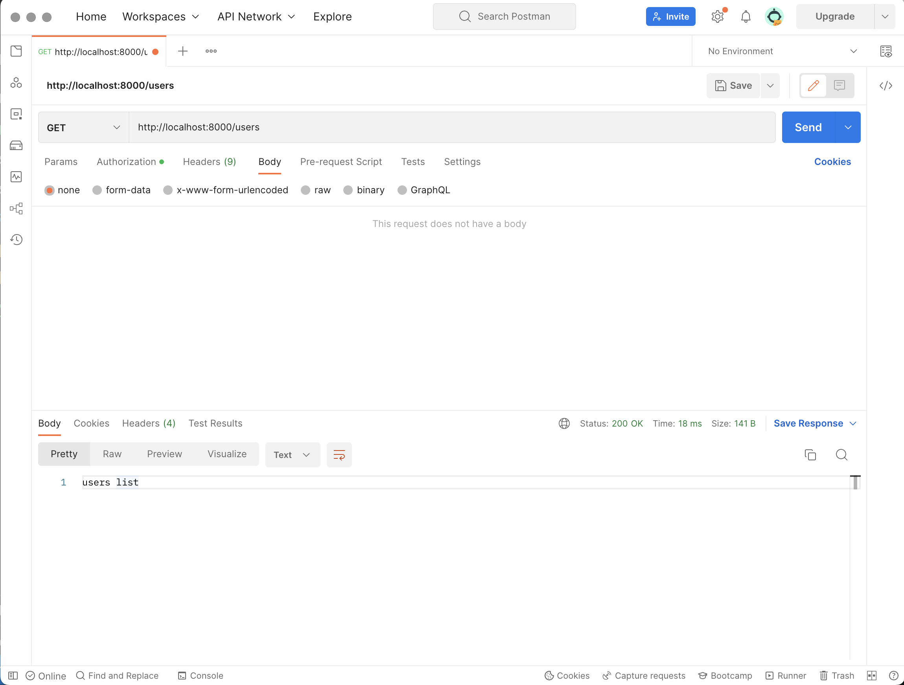
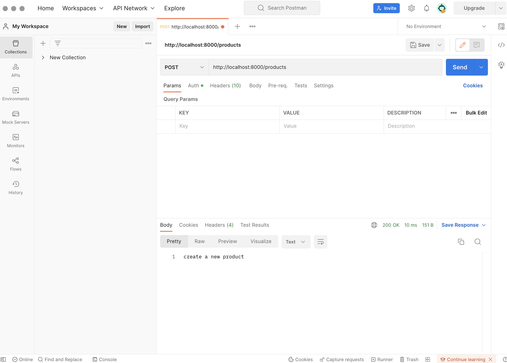
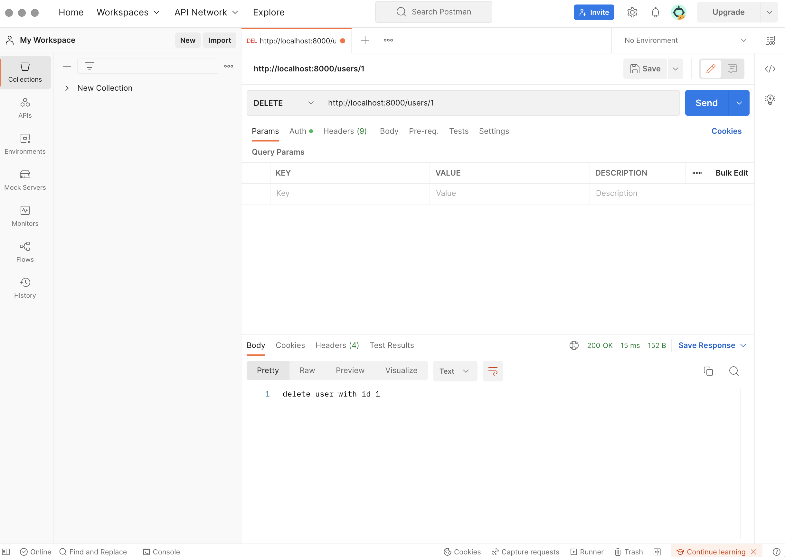

# NodeJS assignment

## How to run

1. Step 1: yarn
2. Step 2: yarn start

## Requirements

1. Create a server in the index.ts file
2. After done create a server create method and suitable url:

- create `GET` method and return/ response: `user list`,
- create `POST` method and return/ response: `create a new product`,
- create `DELETE` method and return/ response: `delete user by id`

## Screenshots

1. get method
   
2. post method 
3. delete method 

### this is yassers homework